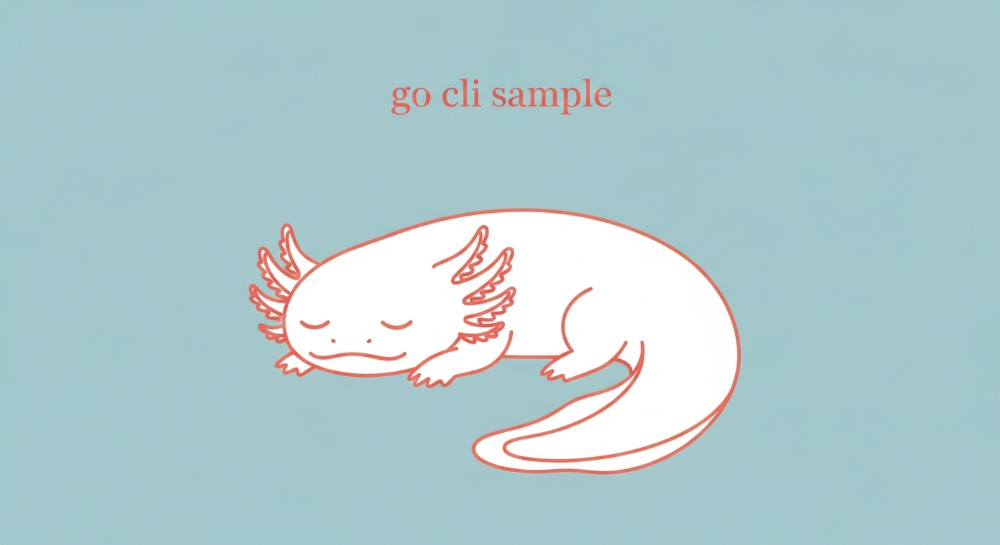

<div align="center">



<p align="center">
  
  
  
  
</p>

</div>

Go言語で作る CLI ツールのサンプル集だよ〜！✨

## 📖 概要

このリポジトリは、Go言語で CLI ツールを作成するための**実用的なサンプル集**です。
基本的な Hello World から、フラグ処理、HTTP クライアント、カラフルな出力まで、
CLI ツール開発で使える様々なテクニックを学べるよ💕

## 📋 必要要件

### ローカル開発の場合
- Go 1.16以上

### Docker環境の場合
- Docker
- Docker Compose

## 🚀 セットアップ

```bash
# リポジトリをクローン
git clone https://github.com/Sunwood-ai-labs/go-cli-sample.git
cd go-cli-sample

# 依存関係をダウンロード（必要に応じて）
go mod download
```

## 💻 使い方

このリポジトリには、複数のサンプルが `examples/` フォルダに入ってるよ〜！
それぞれのサンプルは独立して実行できるから、興味のあるものから試してみてね✨

```bash
# 例: 基本的な Hello World を実行
cd examples/01-basic-hello
go run main.go

# 例: フラグを使ったサンプルを実行
cd examples/02-flags
go run main.go -name "ギャルエンジニア" -count 3

# 例: カラフルな出力を試す
cd examples/08-colored-output
go run main.go
```

各サンプルのディレクトリには、詳しい説明が書かれた `README.md` があるよ！📖

## 🧪 テスト

### テストの実行

```bash
# すべてのテストを実行
go test -v

# カバレッジ付きでテストを実行
go test -v -cover

# カバレッジレポートを生成
go test -coverprofile=test-reports/coverage.out
go tool cover -html=test-reports/coverage.out -o test-reports/coverage.html
```

### ベンチマークの実行

```bash
# ベンチマークテストを実行
go test -bench=. -benchmem
```

## 🐳 Docker環境での実行

### Docker Composeでアプリケーションを実行

```bash
# アプリケーションを実行
docker-compose up app

# テストを実行
docker-compose up test

# ベンチマークを実行
docker-compose up benchmark

# 開発用シェルを起動
docker-compose run --rm dev
```

### 利用可能なサービス

- `app`: アプリケーションを実行
- `test`: テストとカバレッジレポートを生成
- `benchmark`: ベンチマークテストを実行
- `dev`: 開発用インタラクティブシェル

詳しくは [Go言語初心者向けガイド](docs/GETTING_STARTED_JA.md) を参照してください。

## 📊 テストレポート

テスト結果とカバレッジレポートは `test-reports/` ディレクトリに生成されます：

- `coverage.out` - カバレッジデータ
- `coverage.html` - HTMLカバレッジレポート
- `test-results.txt` - テスト実行結果
- `benchmark-results.txt` - ベンチマーク結果

## 🌐 オンラインでカバレッジレポートを確認

GitHub Pagesで最新のテストカバレッジレポートを確認できます：

👉 **[カバレッジレポートを見る](https://sunwood-ai-labs.github.io/go-cli-sample/)** 📈✨

mainブランチにpushされるたびに自動的に更新されます！

## 📁 プロジェクト構成

```
.
├── examples/                    # サンプル集 🎨
│   ├── 01-basic-hello/         # 基本的な Hello World 👋
│   ├── 02-flags/               # フラグの使い方 🚩
│   ├── 03-cobra/               # Cobra でサブコマンド 🐍
│   ├── 04-interactive/         # インタラクティブ入力 💬
│   ├── 05-file-operations/     # ファイル操作 📁
│   ├── 06-http-client/         # HTTP クライアント 🌐
│   ├── 07-json-parsing/        # JSON パース 📋
│   ├── 08-colored-output/      # カラフルな出力 🌈
│   ├── 09-progress-bar/        # プログレスバー ⏳
│   └── 10-table-output/        # テーブル出力 📊
├── main.go                     # （旧）メインファイル
├── main_test.go                # （旧）テストコード
├── go.mod                      # Go モジュール定義
├── Dockerfile                  # Docker 環境の定義
├── docker-compose.yml          # Docker サービスの構成
├── README.md                   # このファイル
├── docs/
│   └── GETTING_STARTED_JA.md   # Go言語初心者向けガイド
└── test-reports/               # テストレポート出力ディレクトリ
```

## ✨ サンプル一覧

各サンプルで学べることを紹介するよ〜！

### 01. 基本的な Hello World 👋
Go の CLI ツールの基本。引数の受け取りと標準出力の使い方を学べるよ。

### 02. フラグの使い方 🚩
`flag` パッケージを使って、コマンドラインフラグ（`-name value` とか）を処理する方法だよ。

### 03. Cobra でサブコマンド 🐍
人気の Cobra ライブラリを使って、`git add` みたいなサブコマンドを作る方法だよ。

### 04. インタラクティブ入力 💬
ユーザーからの対話的な入力を受け取る方法。対話型 CLI ツールが作れるよ！

### 05. ファイル操作 📁
ファイルの読み書き、存在確認、削除など、ファイル操作の基本を学べるよ。

### 06. HTTP クライアント 🌐
Web API を叩く方法。GET リクエストやレスポンスの処理が学べるよ。

### 07. JSON パース 📋
JSON のエンコード/デコード。API レスポンスや設定ファイルの処理に必須だよ！

### 08. カラフルな出力 🌈
ANSI エスケープシーケンスで、ターミナルに色付きテキストを表示する方法だよ。

### 09. プログレスバー ⏳
進捗を視覚的に表示するプログレスバーとスピナーアニメーションの作り方だよ。

### 10. テーブル出力 📊
データをテーブル形式で見やすく表示する方法。リスト表示に超便利だよ！

イケてるっしょ？😉
