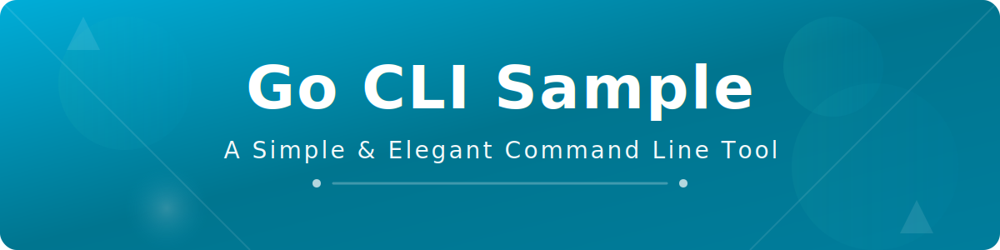

<div align="center">



<p align="center">
  
  
  
  
</p>

</div>

これはGo言語で作ったシンプルなCLIツールのサンプルだよ〜！✨

## 📖 概要

このプロジェクトは、Go言語でCLIツールを作成する基本的な例を提供します。
コマンドライン引数の処理や標準出力の使い方を学ぶことができます。

## 📋 必要要件

### ローカル開発の場合
- Go 1.16以上

### Docker環境の場合
- Docker
- Docker Compose

## 🚀 セットアップ

```bash
# リポジトリをクローン
git clone https://github.com/Sunwood-ai-labs/go-cli-sample.git
cd go-cli-sample

# 依存関係をダウンロード（必要に応じて）
go mod download
```

## 💻 使い方

### 基本的な実行

```bash
# 引数なしで実行
go run main.go

# 引数ありで実行
go run main.go "引数だよん"
```

### ビルドして実行

```bash
# バイナリをビルド
go build

# ビルドしたバイナリを実行
./go-cli-sample "引数だよん"
```

## 🧪 テスト

### テストの実行

```bash
# すべてのテストを実行
go test -v

# カバレッジ付きでテストを実行
go test -v -cover

# カバレッジレポートを生成
go test -coverprofile=test-reports/coverage.out
go tool cover -html=test-reports/coverage.out -o test-reports/coverage.html
```

### ベンチマークの実行

```bash
# ベンチマークテストを実行
go test -bench=. -benchmem
```

## 🐳 Docker環境での実行

### Docker Composeでアプリケーションを実行

```bash
# アプリケーションを実行
docker-compose up app

# テストを実行
docker-compose up test

# ベンチマークを実行
docker-compose up benchmark

# 開発用シェルを起動
docker-compose run --rm dev
```

### 利用可能なサービス

- `app`: アプリケーションを実行
- `test`: テストとカバレッジレポートを生成
- `benchmark`: ベンチマークテストを実行
- `dev`: 開発用インタラクティブシェル

詳しくは [Go言語初心者向けガイド](docs/GETTING_STARTED_JA.md) を参照してください。

## 📊 テストレポート

テスト結果とカバレッジレポートは `test-reports/` ディレクトリに生成されます：

- `coverage.out` - カバレッジデータ
- `coverage.html` - HTMLカバレッジレポート
- `test-results.txt` - テスト実行結果
- `benchmark-results.txt` - ベンチマーク結果

### 🌐 オンラインでカバレッジレポートを確認

GitHub Pagesで最新のテストカバレッジレポートを確認できます：

👉 **[カバレッジレポートを見る](https://sunwood-ai-labs.github.io/go-cli-sample/)** 📈✨

mainブランチにpushされるたびに自動的に更新されます！

## 📁 プロジェクト構成

```
.
├── main.go              # メインのCLIアプリケーション
├── main_test.go         # テストコード
├── go.mod               # Goモジュール定義
├── Dockerfile           # Docker環境の定義
├── docker-compose.yml   # Dockerサービスの構成
├── .dockerignore        # Dockerビルドで除外するファイル
├── README.md            # このファイル
├── docs/
│   └── GETTING_STARTED_JA.md  # Go言語初心者向けガイド
└── test-reports/        # テストレポート出力ディレクトリ
```

## ✨ 機能

- コマンドライン引数の受け取り
- 標準出力への出力
- ユニットテスト
- ベンチマークテスト

イケてるっしょ？😉
